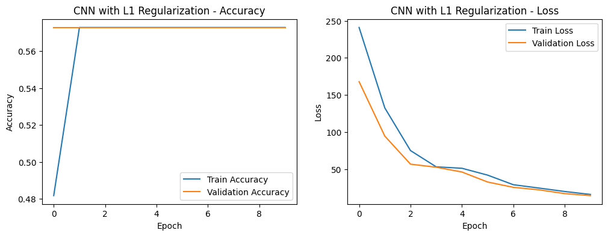

# Gastric Cancer Detection from Endoscopic Images

## Overview

Gastric cancer is a leading cause of cancer-related deaths worldwide, and early detection is crucial for improving patient outcomes. This project explores the application of machine learning to aid in the early detection of gastric cancer through endoscopic image analysis. Three models are implemented in this repository: a **CNN-based model using ResNet50**, an **SVM model with pre-extracted ResNet50 features**, and a **Random Forest model trained on hand-crafted image features**. These models aim to assist medical professionals by automating and enhancing the detection process.

## Table of Contents

- [Project Structure](#project-structure)
- [Dataset](#dataset)
- [Models](#models-overview)
- [Installation](#installation)
- [References](#references)

---

## Project Structure

```plaintext
Gastric_cancer_classification-Model/ │ 
├── saved_models/ # Directory to save trained model files 
│ ├── cnn_model_l1_regularization.h5 # CNN model with L1 regularization 
│ ├── cnn_model_l2_regularization.h5 # CNN model with L2 regularization 
│ ├── vanilla_cnn_model.keras # Vanilla CNN model 
│ └── vgg16_transfer_learning.keras # VGG16 transfer learning model 
├── Daniel_Ndungu_Summative_Assignment.pdf # Project report 
└── README.md # Documentation for the project
```


## Dataset

This project uses the **Kvasir dataset** for training and evaluation. The dataset includes various endoscopic images of the gastrointestinal tract, including images of normal and cancerous tissues.

Type of images in the Kvasir Dataset:


**Note**: The Kvasir dataset should be organized in `data/` with subfolders for each class label (e.g., `normal`, `cancerous`).

- **Download**: The dataset is available from [Kvasir Dataset](https://datasets.simula.no/kvasir/).
- **Structure**:
  - Place images in subdirectories based on class labels (e.g., `data/normal/` and `data/cancerous/`).
  


## Models Overview

### 1. Vanilla CNN Model
The Vanilla CNN model is a simple convolutional neural network built from scratch for gastric cancer classification. This model consists of several convolutional layers, followed by max pooling, and fully connected layers. It serves as a baseline model to understand the basic performance before applying regularization or transfer learning.

- **Architecture**: Convolutional layers with ReLU activation, followed by max pooling and dense layers.
- **Performance**: Baseline model for comparing against regularized and transfer learning models.


### 2. CNN Model with L1 Regularization
The CNN with L1 regularization model incorporates L1 penalties on the weights of the network, promoting sparsity in the learned weights. This can help in reducing overfitting and potentially improve generalization.

- **Architecture**: Similar to the Vanilla CNN, but includes L1 regularization in the dense layers.
- **Purpose**: To evaluate the effect of L1 regularization on model performance.




### 3. CNN Model with L2 Regularization
The CNN with L2 regularization model adds L2 penalties, which constrain the network weights by penalizing large weights. This regularization technique helps prevent overfitting and makes the model more robust.

- **Architecture**: Similar to the Vanilla CNN, but includes L2 regularization in the dense layers.
- **Purpose**: To assess the impact of L2 regularization on the model's ability to generalize to unseen data.


### 4. VGG16 Transfer Learning Model
The VGG16 Transfer Learning model utilizes a pre-trained VGG16 model, fine-tuned to classify gastric cancer images. Transfer learning allows us to leverage learned features from a large dataset, significantly improving performance, especially when limited data is available.

- **Architecture**: VGG16 base with additional fully connected layers for the specific task.
- **Purpose**: To leverage the advantages of transfer learning in medical imaging and compare it with other CNN models developed from scratch.


## Getting Started


### Installation
1. Clone the repository:
    ```bash
    git clone https://github.com/yourusername/Gastric_cancer_classification-Model.git
    ```
2. Navigate into the project directory:
    ```bash
    cd Gastric_cancer_classification-Model
    ```

### Training the Models
1. Use the scripts provided in the project to train each model.
2. The data should be preprocessed and split into training and validation sets before training.

### Evaluation
Each model is evaluated based on accuracy, precision, and confusion matrix. The evaluation graphs and confusion matrices above provide a comparative overview of each model’s performance.

## Conclusion
This project explores different CNN architectures and regularization techniques to enhance the early detection of gastric cancer from endoscopic images. The VGG16 transfer learning model, leveraging pre-trained features, is expected to outperform other models due to the advantages of transfer learning, especially in the medical imaging domain.

## References
- E. Klang, A. Sourosh, G. Nadkarni, K. Sharif, and A. Lahat, “Deep Learning and Gastric Cancer: Systematic Review of AI-Assisted Endoscopy.,” Diagnostics, vol. 13, no. 24, p. 3613, Dec. 2023.

- M. Popa, M. Cruciera, and B. Diaconu, “SURVEY OF MACHINE LEARNING APPLICATIONS IN MEDICAL IMAGING. ALGORITHMS AND TECHNOLOGIES.,” Fiability & Durability / Fiabilitate si Durabilitate, no. 1, pp. 219–224, May 2023.

